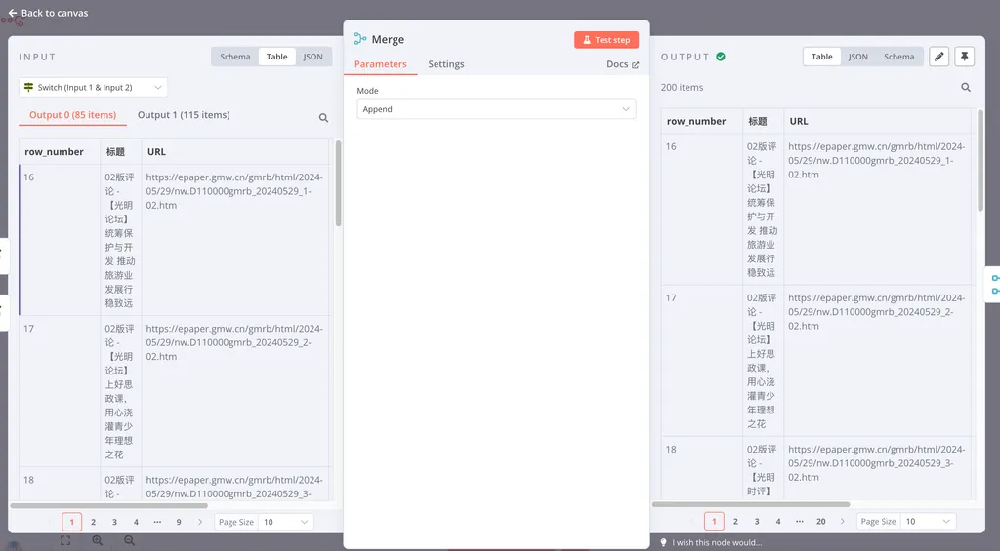

# 🔂 n8n 常用逻辑节点详解

## 📚 概述

对于学习编程来说，不管是任何语言，首先需要学习的就是逻辑与判断。尽管 n8n 舍弃了编码的过程，但对于制作 Workflow 来说，本质上仍然是在用图形化进行编程，因此你需要用到一系列逻辑节点。

在 n8n 中，逻辑节点被归类在 **Flow** 类目下，也就是流程控制。

## 🎯 支持的流程控制节点

| 节点名称 | 功能说明 |
|---------|----------|
| **Filter** | 过滤，从上游输入的一堆 items 里过滤掉不满足条件的 |
| **If** | 判断，根据上游输入的数据判断给出 true 和 false 结果，并将数据流分叉成两个 |
| **Loop Over Items** | 循环，将上游输入的一堆 items 中的每一个，运行一遍 loop 中的部分，当所有 items 运行完毕之后，将所有运行结果打包输出给下游 |
| **Merge** | 合并，将两个上游输出的数据合并成一个 |
| **Compare Datasets** | 比较，将两个上游输出的数据进行比较，并决定在什么情况下用哪一个输出给下游 |
| **Execute Workflow** | 执行另一个 Workflow |
| **Stop and Error** | 停止 Workflow 并输出错误 |
| **Switch** | 路由，可以理解为 If 的进阶版，根据上游输入的数据进行多重判断，并依据结果将数据流分叉成多个 |
| **Wait** | 等待，运行到这里暂停一会儿，主要用于向第三方 API 发起请求时避免超过对方访问限制 |

> 💡 **提示**：流程控制节点一般来说非常简单，如果你能理解它所对应的逻辑本身，你在看完这个表之后应该已经知道如何用了。

## 🚀 实战案例详解

如果你此前没有过任何编程经验，下面我们将通过四个实际的例子来讲解 **If**、**Switch**、**Merge**、**Loop** 四个 n8n 中最常用的逻辑控制节点。

---

### 案例1：使用 If 节点进行条件判断

**场景**：我有一张数据表，其中一列是文章标题，我希望在后续的 Workflow 中对包含"评论"的内容单独处理，我该如何操作？

#### 实现步骤：

1. **配置 If 节点**：使用它来判断标题中是否存在"评论"两个字
2. **设置条件**：添加一个 Conditions（条件），以 `{{ $json['标题'] }}` 为判断源
3. **判断逻辑**：如果它 contains（包含）"评论"二字，就返回 true，否则就返回 false

#### 结果说明：

在 Output 面板，我们可以看到后续 Workflow 被分为了：
- **True Branch**：85 个 item（包含"评论"的文章）
- **False Branch**：2710 个 item（不包含"评论"的文章）

#### 高级功能：

- **多种判断类型**：支持字符串、数字、日期与时间、布尔值、数组和对象字段类型的判断
- **逻辑连接符**：支持多个 Conditions 之间用 AND（且）与 OR（或）连接
- **示例**：可以设置判断"包含评论"且"包含高质量"，或者判断"包含评论"或"包含高质量"

---

### 案例2：使用 Switch 节点进行多重判断

**场景**：我有一张数据表，其中一列是文章标题，我希望在后续的 Workflow 中对"包含评论"、"包含高质量"、"包含要闻"的内容分别单独处理，我该如何操作？

#### 为什么选择 Switch？

经过 If 的学习，你应该会意识到，这个案例中的判断，其实可以通过设置多层 If 来实现。比如先处理包含评论的，再处理包含高质量的，最后再处理包含要闻的。但这样会增加 Workflow 的复杂程度，还会降低它的运行效率。

因此，在面临这种需要处理两个以上分叉路径的逻辑时，我们就可以用更复杂的 **Switch** 来处理。

#### 实现效果：

Switch 节点支持你添加多个判断逻辑，它会根据每个判断逻辑将匹配的数据送往对应的分叉。运行之后，数据流被分为三叉：
- 标题里有"评论"的
- 标题里有"高质量"的  
- 标题里有"要闻"的

#### 重要配置选项：

**串联判断模式（默认）**：
- 按照配置路由规则的上下顺序，从上到下判断
- 一条数据如果已经被匹配到了分叉1，它就不会再出现在分叉2里

**并联判断模式**：
- 在 Options 里开启 `Send data to all matching outputs`
- 一条数据在同时满足分叉1和分叉2的情况下，会同时出现在两个分叉里

---

### 案例3：使用 Merge 节点合并数据流

**场景**：我从数据表中筛选出了对"包含评论"、"包含高质量"和"包含要闻"的内容，我现在分别对他们的数据处理已经完成，现在希望把它们合并回一个数据流写进库里，怎么办？

#### 实现方法：

由于 Merge 节点一次只能合并两个分叉，所以我们要合并两次：
1. 先合并两个分叉
2. 再将第三个与已经合并后的分叉进行合并

#### 合并模式选择：

由于我们的三个分叉出来的数据流在表头（属性）上是一致的，因此我们可以直接选择 **Append** 作为合并模式。

#### 三种合并模式详解：

| 模式 | 说明 | 适用场景 |
|------|------|----------|
| **Append** | 直接将分叉2的数据加在分叉1的后面 | 表头（属性）完全一致的两个分叉合并 |
| **Combine** | 将分叉2与分叉1同一索引的不同表头合并到一起 | 分叉2里有姓名和年龄，分叉1里有姓名和性别，合并后获得包含姓名、年龄和性别的数据表 |
| **Merge by Position** | 按分叉2和分叉1的数据位置，直接把两个数据强加在一起 | 适用范围比较窄，特殊场景使用 |

---

### 案例4：使用 Loop 节点处理多个 RSS 源

**场景**：从多个 RSS 处获取内容怎么办？

#### 重要概念：内置循环

n8n 中支持 **Loop Over Items** 节点来创造一个循环。但是，在大部分情况下你不需要该节点来创造循环。

**是不是不太理解 为什么？**

当我们在日常编程的时候，如果需要对一个数据表中的每一行进行处理，我们首先想到的是需要构造一个循环。但对于 n8n 来说，它考虑到了这种常见用法，因此许多 n8n 中的节点是**内置循环**的。

#### 内置循环示例：

上游节点传来了一个包含10行包含URL的数据表，你在当前节点想用 RSS Read 读取这10个RSS地址里的内容，你实际上不需要用到 Loop Over Items。

在默认情况下，当你就将一个数组变量拖动到当前节点的时候，当前节点就会将数组变量中的每一行都执行一遍。

#### 控制循环执行：

如果你想让某个节点在处理某个数组变量里的值时，只运行一次，你需要在节点的 Settings 页面打开 **Execute Once** 选项。

#### 条件结束循环：

n8n 节点中的内置循环，甚至包含了依据条件结束循环，你只需要这样连接一个 If 节点即可：

在这个官方示例中，If 的 True 分叉被指回了 Twitter 节点的输入端。这意味着，在 Twitter 节点被运行到第5次时，节点会进入 false 分叉结束循环。

if节点的判断条件是 {{$runIndex}} Is Less Than 4

**该工作流的结果**：会自动在 Twitter 上发送5遍 "Hello from n8n!"

#### 何时使用 Loop Over Items？

在一些特殊的情况下（比如想要分批处理），我就想用 Loop 来构造循环怎么办？

**实现方式**：

添加一个 Loop Over Items，它会将上游传递过来的 URL，分批次循环执行 RSS Read。当所有的批次执行完毕之后，数据被合并推送到 done 分叉，执行后续的循环外操作。

**与内置循环的区别**：

在这里我将 Loop Over Items 的 **Batch Size** 参数设置为了10。这意味着，它会首先将上游传递过来的数据，拆分成10行一包，每次只向循环中的 RSS Read 发送10包。

**实际应用**：

如果我在循环内加一个 Wait 节点，并且设置为 Wait 1分钟，就可以有效的控制每分钟只对10个RSS地址发起请求，拉长请求间隔，避免被对方服务器封禁。

#### 建议使用 Loop Over Items 的场景：

1. **分批处理数据**：以控制 Workflow 的性能消耗
2. **错误隔离**：你十分确定输入进来的数据有时会导致节点运行错误，你希望在某一行运行错误的情况下，剩下的行依然能继续处理
3. **频率控制**：你希望控制数据处理的频度，以保障第三方 API 可以正常运行

---

## 📖 总结

通过这四个案例的学习，你应该已经掌握了 n8n 中最常用的逻辑控制节点：

- **If**：简单的条件判断和分流
- **Switch**：复杂的多重判断和路由
- **Merge**：数据流的合并操作
- **Loop**：循环处理和批量操作

这些节点是构建复杂 Workflow 的基础，掌握它们的使用方法，你就能创建出功能强大的自动化工作流了！

---
