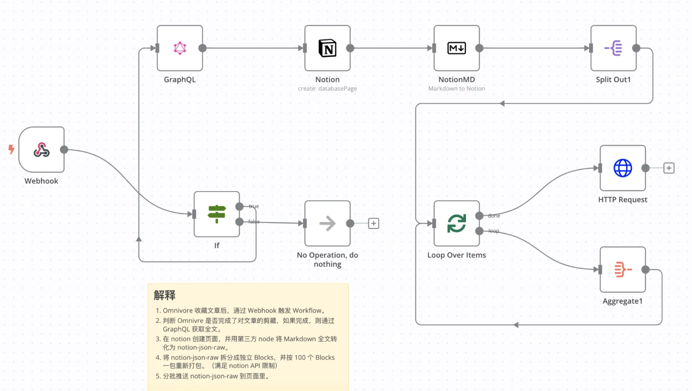
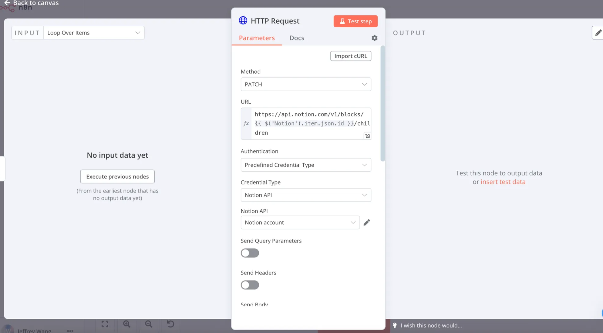
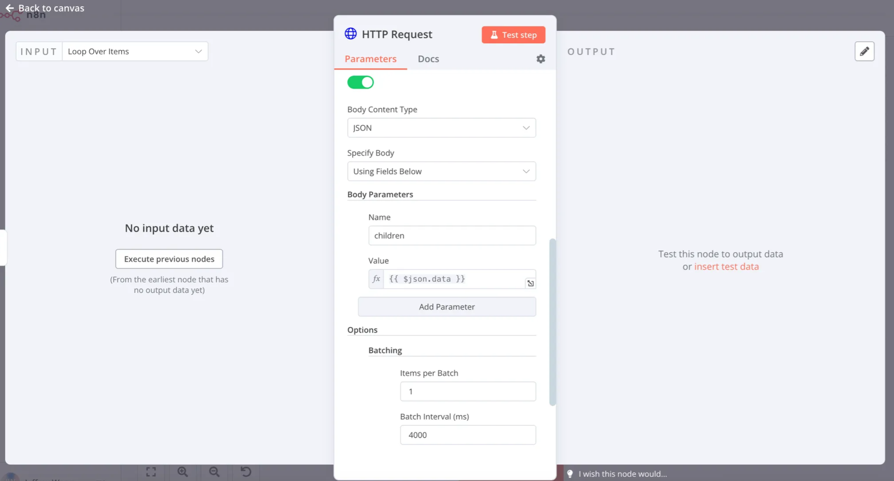

# 🆓 半开放式节点（Code / HTTP Request）详细介绍

与 Coze 这类“全封装在线服务式”流程工具相比，n8n 的一大优势是“半开放式节点”。当官方未提供现成集成时，你仍可用这些节点手动对接能力：
- Code：直接写 JavaScript 或 Python 以实现自定义逻辑
- HTTP Request：对任意 URL 发起 HTTP 请求，集成任意对外 API（如飞书、企业微信、国产大模型等）

> 💡 如果你完全不想写代码，n8n Cloud 提供 AI Code 功能：用自然语言描述需求，由 AI 生成可运行的 Code 节点。

---

## 1. Code 节点

Code 节点允许你以最小的限制直接编写逻辑，弥补“无现成节点可用”的空缺。

### 1.1 参数概览

| 参数 | 说明 |
|---|---|
| Mode | 运行模式：Run Once for All Items / Run Once for Each Item |
| Language | 脚本语言：JavaScript 或 Python（JS 更稳定、生态更全）|
| Code | 实际执行的脚本内容，支持引用上游数据（需手写表达式）|

- Mode 选择建议：
  - Run Once for All Items：对“整组数据”进行整体操作（如汇总、拼接、增删列）
  - Run Once for Each Item：对“每一行数据”单独处理（如逐条改写字段）

### 1.2 引用上游数据示例（JavaScript）

以下示例将上游节点 `Aggregate` 的 `data`（文章数组）拼接为一段带序号的整文：

```javascript
const articles = $node["Aggregate"].json["data"]; // 上游节点变量
let fullText = "";
let index = 1;

articles.forEach((article) => {
  fullText += `第${index}篇标题: \n# ${article.title}\n第${index}篇正文:\n${article.markdown}\n第${index}篇source: ${article.link}\n\n`;
  if (index < articles.length) {
    fullText += "---------------\n\n";
  }
  index++;
});

return [{ json: { fullText } }];
```

> 提示：`$node["节点名"].json[...]`、`$json[...]` 等可读取上游数据；Code 节点里可以直接从 INPUT 面板拖拽，无需“手写变量表达式”。

### 1.3 注意事项

- 模块依赖：默认仅内置少量 JS 库，如需更多库请参考官方文档启用
  - 占位链接：Enable modules in Code node | n8n Docs
- 文件操作：Code 节点不读写本地文件。需配合 `Read File(s) From Disk` / `Write File to Disk` 节点
- 网络请求：Code 节点不建议直接发起 HTTP 调用。请改用 `HTTP Request` 节点
- Python 运行时：基于 Pyodide，库较少、性能一般；若无刚需优先选 JS

---

## 2. HTTP Request 节点

顾名思义，它用于向任何可访问的 URL 发起 HTTP 请求。是对接未内置服务（如飞书、企微、国产大模型等）的“总入口”。

### 2.1 常见使用场景

- 从第三方 API 拉取数据（天气、股市、社交平台等）
- 向外部服务提交数据（创建记录、推送消息、提交表单）
- 触发自建接口或爬虫入口
- 连接 n8n 未原生集成的服务（只要有 API 即可）

### 2.2 参数概览

| 参数 | 说明 |
|---|---|
| Method | 请求方法：GET / POST / PUT / DELETE / HEAD / OPTIONS / PATCH |
| URL | 请求地址，支持表达式注入上游变量 |
| Authentication | 鉴权：None / Predefined Credential Type / Generic Credential Type |
| Send Query Parameters | 查询参数（key-value）|
| Send Headers | 请求头（Content-Type、Authorization 等）|
| Send Body | 请求体（Raw / JSON / Form 等）|
| Options | 进阶设置（如 Batching、超时、重试等）|

> 小贴士：不熟悉 API 细节时，先用 Postman / RapidAPI 调试，确认无误后通过“Import cURL”粘贴到 HTTP Request 节点。

### 2.3 实用调试流程

1) 在 Postman 构造请求 → 测试通过 → 导出 cURL
2) 在 HTTP Request 面板右上角点击 Import cURL → 粘贴导出的 cURL
3) 补充必要的鉴权与变量表达式 → 试运行查看响应

---

## 3. 实战案例：向 Notion 推送内容

场景：将上游已处理好的 JSON 内容作为 children 同步到 Notion 指定页面。

占位图：
- 
- 
- 

### 3.1 关键设置说明

- Method
  - 选择 PATCH（依据 Notion API：Append block children 采用 PATCH）

- URL
  - `https://api.notion.com/v1/blocks/{{ $('Notion').item.json.id }}/children`
  - 其中 `{{ $('Notion').item.json.id }}` 引用上游 Notion 节点返回的页面/块 ID

- Authentication
  - 选 Predefined Credential Type → 选择 Notion → 在 Credentials 中配置 Notion API 凭证

- Send Query Parameters / Send Headers
  - 本例无需额外 Query
  - Headers 由凭证/节点自动处理为主（特殊场景可手动补充）

- Send Body（必须）
  - Body Parameters 新增 `children`
  - 值设为 `{{ $json.data }}`（即上游传来的完整块结构 JSON）

- Options → Batching
  - 开启分批提交：每批 1 个 item，批间隔 4 秒，避免触发 Notion 速率限制

---

## 4. 综合建议与思路发散

- 将 Code 与 HTTP Request 结合，你几乎可以“拼”出任何缺少原生节点的能力
- 初学者优先：
  - 逻辑加工用 Code（JS 优先），网络调用交给 HTTP Request
  - 不确定 API 调用参数时，先在 Postman/RapidAPI 里调通，再导入 cURL
- 国内生态：
  - 未提供官方节点时，用 HTTP Request 对接飞书/企微/国产大模型
  - 复杂编排可把既有 Workflow 封装为“Custom n8n Workflow Tool”，供 AI Agent 调用

---

## 5. 模板与可复用片段

- 通用 HTTP JSON 提交模板（Body=JSON）：
```json
{
  "title": "{{ $json.title }}",
  "content": {{ $json.content }}
}
```

- 标准错误处理思路：
  - HTTP Request 开启“Continue On Fail”，配合分支记录失败项；或在后续用 IF/Filter 捕获 `{{ $json.error }}`
  - Options 设置合理的超时与重试策略

---

## 6. 常见问题（FAQ）

- Code 节点能否安装第三方 NPM 包？
  - 可参考官方“启用模块”文档；在托管环境需注意安全与白名单限制
- 为什么 Code 里不直接发 HTTP？
  - 可维护性与可视化调试更差。HTTP Request 有鉴权、日志、重试、批次等完善功能
- Notion/飞书等 API 报 429（限流）怎么办？
  - 开启 Batching，降低频率；必要时在链路中加入 Wait 节点进行节流

---

通过熟练掌握 Code 与 HTTP Request 两个“半开放式”节点，你可以在 n8n 中搭建具备高度可塑性的自动化能力：既能灵活处理复杂数据，又能对接几乎任何开放 API。
