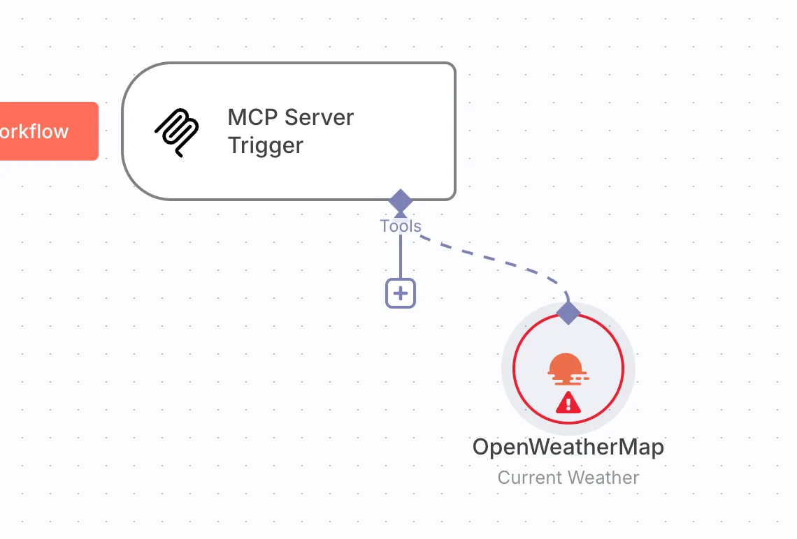
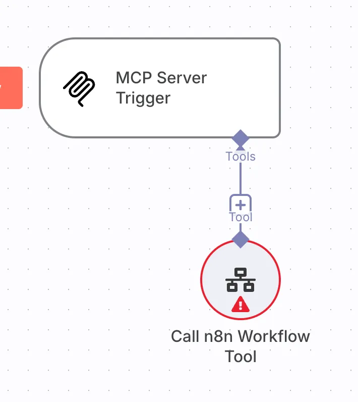
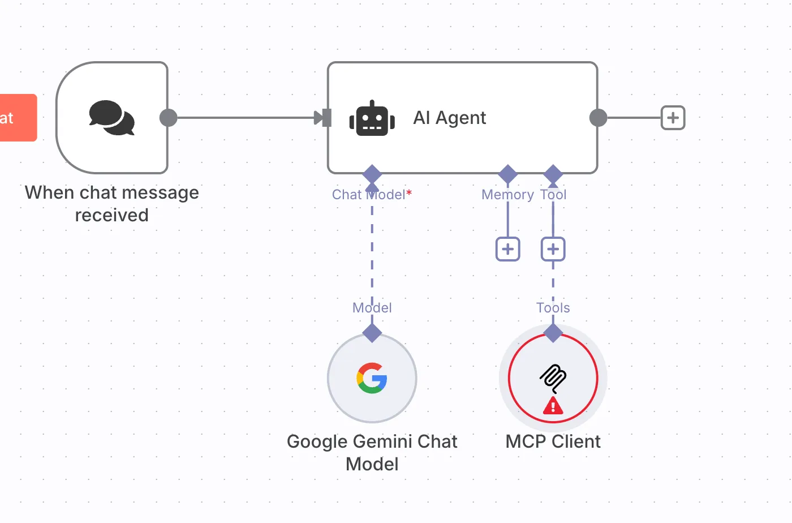

# 🔌 n8n 中如何使用 MCP（模型上下文协议）

## 前言

MCP（Model Context Protocol）被称为“大模型的 USB 接口”，用于让 LLM 以标准化方式调用外部数据与工具。自 2024 年底起，n8n 原生支持 MCP，使自动化工作流与 AI 工具链能够低代码互联。本文将介绍 MCP 是什么、在 n8n 中的两种使用方式，以及可直接上手的配置步骤与示例。

---

## MCP 是什么？为何适合与 n8n 结合

- MCP 由 Anthropic 推出的开放标准，为 LLM 提供统一的“工具/数据”接入协议
- 核心优势：标准化接口、上下文保持、模块化、动态发现、双向通信
- n8n 本身具备“节点化、可编排”的特性，与 MCP 的“可插拔工具”模式天然契合

> 类比：MCP 像“AI 的 USB”，而 n8n 则是“万能扩展坞”，两者结合可快速把企业的系统、API、工作流能力暴露给 LLM，或在工作流中灵活调用外部 MCP 工具。

---

## n8n 对 MCP 的支持方式与适用场景

### 内置节点（截至 2025）
- MCP Server Trigger：让 n8n 充当 MCP Server，把你的 Workflow/工具以 MCP 工具形式暴露给 LLM 调用
- MCP Client Tool：让 n8n 作为 MCP Client，连接外部 MCP Server 调用其工具（资源、Prompt、功能）

### 典型场景
- AI 调用 n8n 自动化：让 Claude、GPT-4o 等 LLM 通过 MCP 直接触发 n8n 的自动化流程，比如自动抓取网站、分析数据、发送通知等。
- n8n 调用 AI 工具链：在 n8n 工作流中，通过 MCP Client Tool 节点，动态调用第三方 MCP Server（如自定义知识库、外部 API 工具等），实现多模型、多工具协作。
- 企业级协同与数据整合：在复杂业务场景下，n8n 通过 MCP 实现与 CRM、ERP、知识库等系统的无缝对接，自动化业务流程并赋能 AI。

> 但值得注意的是，在 n8n 中你应坚持原生节点优先原则：由于 MCP 并非为 n8n 设计，因此如果你想要连接的服务（比如 notion），在 n8n 中有原生节点时，你应当优先选择 n8n 原生节点而非 MCP。实测在效果和效率上都优于 MCP。

对比建议（简要）：
- 性能：原生节点 高 > MCP Client 中
- 可连 AI 节点：二者皆可
- 可连非 AI 节点：原生节点可以，MCP Client 通常不可直连非 AI 生态
- 成熟度与生态：原生节点更稳定；MCP Client 社区工具多但质量不一
>建议你：除非你找不到n8n原生或者社区节点，否则你都不应该在n8n中使用MCP Clinent
---

## 使用前准备

- n8n 版本：建议 v1.94.0 及以上
- 已启用“社区节点”功能（便于安装更新 MCP 相关节点）
- 在节点面板搜索 “MCP”，安装/启用所需节点

---

## 方法一：n8n 作为 MCP Server（对外暴露工具）
- 
场景：让 n8n 提供“天气查询”工具给 LLM 使用

步骤：
1. 新建工作流，添加节点：MCP Server Trigger
2. 在参数中配置：
   - 工具名称：`get_weather`
   - 工具描述：如“获取指定城市的天气信息”
   - 输入参数：`city`（string）等
3. 在 Tool 分支下实现工具逻辑：可用 HTTP Request 调第三方天气 API，或调用自有数据源，拼装输出
4. 启动工作流，n8n 会监听 MCP 连接，并向外暴露该工具
5. 在 Claude Desktop、Cursor 等支持 MCP 的客户端中，添加 n8n 的 MCP Server 地址，即可让 AI 直接调用 `get_weather`

占位图：
- 

进阶：
- 如果某个 MCP 工具需要触发复杂流程，可在 Tool 分支连接“Call n8n Workflow Tool”，转而调用另一个完整 Workflow
- 安全建议：MCP Server 仅在可信网络/内网开放，避免暴露敏感自动化接口

---

## 方法二：n8n 作为 MCP Client（调用外部工具）

场景：在工作流中调用外部 MCP Server 的“知识检索”工具

步骤：
1. 在工作流中添加节点：MCP Client Tool
2. 配置 MCP Server 地址（本地或云端）
3. 选择要调用的工具（如 `knowledge_search`），填写参数（如 `query`）
4. 将返回结果传给下游节点（如写入 Notion、发送邮件、入库等）

占位图：
- 

参考：本地快速起一个 Python MCP Server（示例）
```python
from mcp.server.fastmcp import FastMCP
import asyncio

mcp = FastMCP(name="weather-demo", host="0.0.0.0", port=1234)

@mcp.tool(name="get_weather", description="获取指定城市的天气信息")
async def get_weather(city: str) -> str:
    weather_data = {
        "北京": "北京：晴，25°C",
        "上海": "上海：多云，27°C"
    }
    return weather_data.get(city, f"{city}：天气信息未知")

async def main():
    print("✅ 启动 MCP Server: http://127.0.0.1:1234")
    await mcp.run_sse_async()

if __name__ == "__main__":
    asyncio.run(main())
```
将 n8n 的 MCP Client Tool 指向上述地址，即可在流程中远程调用 `get_weather` 并处理返回结果。

---

## 最佳实践与注意事项

- 原生优先：能用 n8n 原生/社区节点就不要用 MCP Client（更快更稳更直连）
- 分层设计：将可复用能力独立为 Workflow，再由 MCP Server 暴露为工具，便于统一治理与版本化
- 安全与限流：对外暴露时注意鉴权、速率限制与审计；必要时在链路中加入 Wait/Retry
- 调试方法：优先用 MCP 客户端（如 Claude Desktop）单测工具可用性，再接入 n8n 编排

---

## 常见问题（FAQ）

- Q：MCP 工具与 n8n 原生节点有何取舍？
  - A：优先原生节点；仅当无现成节点或需快速对接新工具时用 MCP。
- Q：MCP Client 能否直接连接非 AI 节点？
  - A：通常不行；MCP Client 设计目标是连接 MCP 生态工具。要与业务系统交互，优先用原生节点（HTTP/DB/Notion 等）。
- Q：如何避免被外部滥用 MCP Server？
  - A：仅在内网或受控网络开启；配合反向代理鉴权与访问控制；开启审计日志。
- Q：跨模型供应商是否通用？
  - A：MCP 为开放协议，理论上可与多家 LLM 协作；具体兼容性以各客户端实现为准。

---

## 总结

MCP 让“AI 调工具/取数据”变得标准而简单；n8n 则负责把这些能力编排为可靠的自动化流程。二者结合后：
- 让 LLM 触发你的工作流（MCP Server 模式）
- 让工作流调用外部 AI/工具（MCP Client 模式）

只需少量配置，你就能把企业数据与自动化能力即插即用地接入 AI，开启更强大的智能流程。
